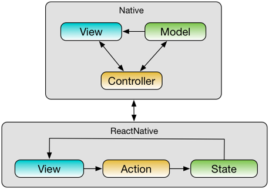

## ReactNative起步

### 必备知识点
- es6 / es7
    - () => {}
    - class
    - promise
    - async await
    - 一些语法糖map、foreach。。。
    - 等等
- react.js
    - 生命周期
    - props state
    - diff
    - virtual dom
    - 等等
- flexbox
    - justContent
    - flexDirection
    - alignItems 
    - 等等
- JSX

###### native 与 rn 开发模式


Native最常见的是MVC开发模式，数据通过controller设置到view上，view上的交互再通过controller反映到model上。而在RN开发中，所有界面的结构组织及展示都是基于组件的，

### props & state
###### props
- props 是一种从父级向子级传递数据的方式
- props 不应被手动修改
- props 也是父子组件进行通信的一种方式
###### state
- state 是component的状态，每个component都是一个状态机
- 在constructor中初始化
- 通过this.setState()修改

||props|state|
|-----|----|---|
|能否从父组件获取初始值|true|false|
|父组件能否修改|true|false|
|在组件内部能否修改|false|true|

###### 示例
父组件调用
```js
<Clock clickAction={() => {console.log('Clock click!')}}/>
```
Clock类
```js
import React from 'react';
import {
    StyleSheet,
    Text,
    View,
    TouchableOpacity
} from 'react-native';
import PropTypes from 'prop-types';

class Clock extends React.Component {
    static propTypes = {
        clickAction: PropTypes.func,
    };

    constructor(props) {
        super(props);
        this.state = {
            secondCount: 0,
        };
    }

    componentDidMount() {
        console.log('ImageItem did mount.');
        this.timer = setInterval(
            () => {
                this.setState((state) => {
                    return {
                        ...state,
                        secondCount: state.secondCount + 1,
                    };
                });
            },
            1000,
        );
    }

    componentWillUnmount() {
        clearInterval(this.timer);
    }

    render() {
        return (
            <TouchableOpacity
                onPress={() => {
                    if (this.props.clickAction) {
                        this.props.clickAction();
                    }
                }}
            >
                <View style={styles.view}>
                    <Text style={styles.text}>
                        {'Stay ' + this.state.secondCount + 's'}
                    </Text>
                </View>
            </TouchableOpacity>
        );
    }
}

const styles = StyleSheet.create({
    view: {
        marginVertical: 20,
        flexDirection: 'row',
        justifyContent: 'center',
        alignItems: 'center',
    },
    text: {
        fontSize: 20,
        color: '#ff9942',
    }
});

export default Clock;
```

### 生命周期

- 在 ```shouldComponentUpdate(nextProps, nextState) ```方法中，我们可以根据 nextProps 或 nextState 的值来确定是否需要重新渲染组件。默认是返回 true，如果返回 false，则后续流程会被中断。**主要是用来判断不必要的渲染逻辑，当这里判断逻辑的复杂度如果超过了diff算法，就会得不偿失**。
- ```componentWillUpdate(nextProps, nextState)``` 是在即将更新组件之前的操作。这个方法在当前最新版本的react.js中被重命名为 UNSAFE_componentWillUpdate(nextProps, nextState)。在这个方法中，我们不能去调用 setState 方法，或者做其它可能会引起组件重新渲染的操作。
- ```componentDidUpdate(prevProps, prevState, snapshot)``` 方法会在组件重新渲染完成之后调用。我们可以看到这时参数名已变成 prevProps和 prevState，保存的是更新之前的 props 和 state。在这个方法中，可以去执行 DOM 操作，也可以去做网络请求等操作。这里虽然可以调用 setState() 方法，不过需要注意加判断逻辑，避免无限循环。

react.js 16.3版本后，实际上，在官方的最新文档中，有几个生命周期方法已被标记为 UNSAFE
- UNSAFE_componentWillMount()
- UNSAFE_componentWillUpdate()
- UNSAFE_componentWillReceiveProps()

这几个方法对应的无前缀方法如下：
- componentWillMount()
- componentWillUpdate()
- componentWillReceiveProps()

```static getDerivedStateFromProps(props, state)```
这是在 React 16.3 新加入的方法，主要是为了避免在 UNSAFE_componentWillReceiveProps 中使用 setState() 而产生的副作用。生命周期为下图所示


